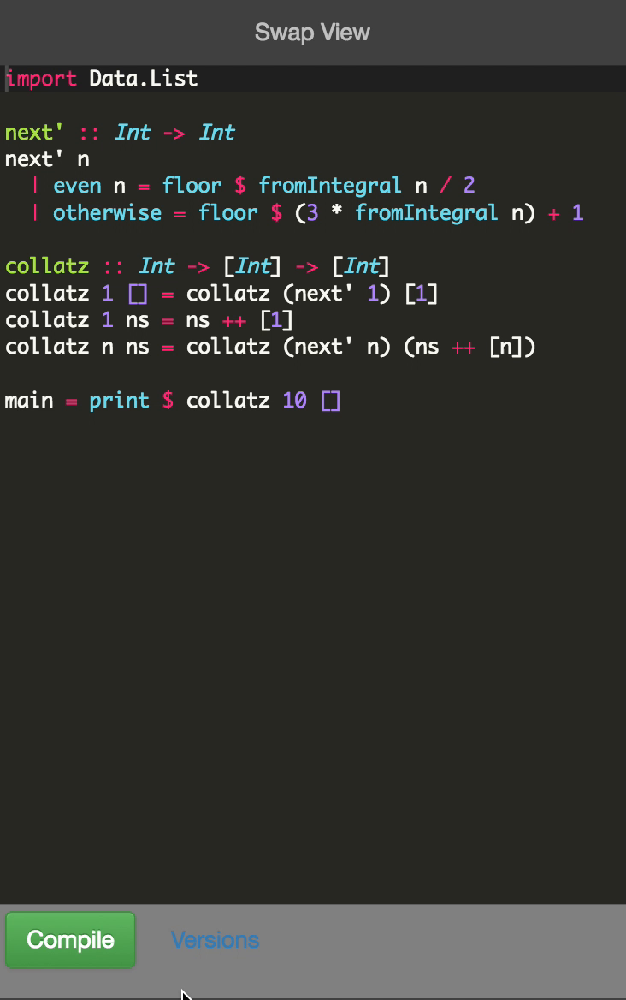
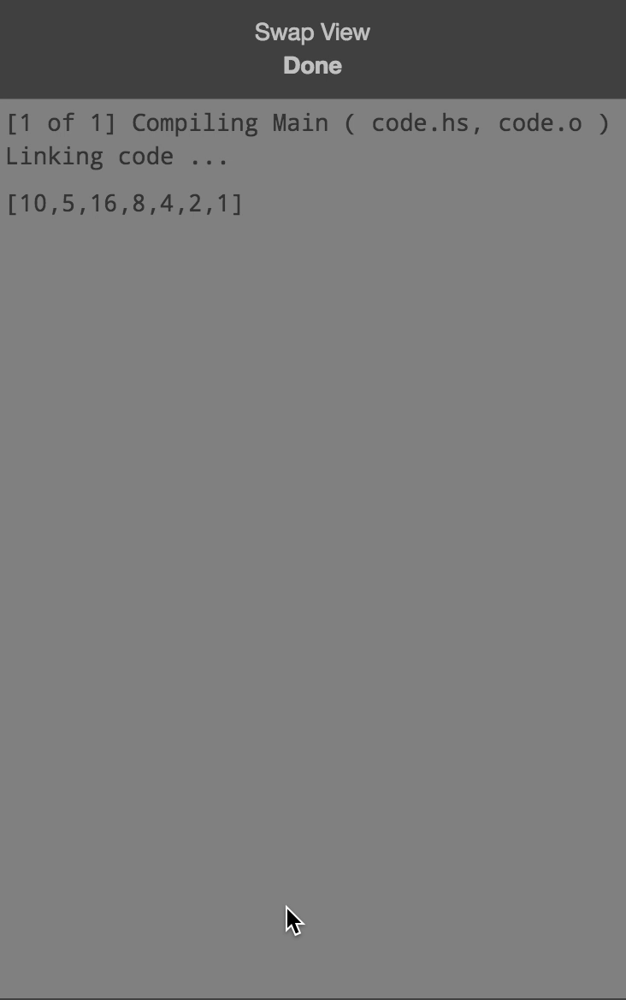

# Haskell Web Compiler

## Installation

Dependencies are managed with NPM.

```
npm install
```

You will also need `ghc` on your `PATH`.

Now you may start coding. Open,

https://example.com/haskell/index.php

Tested on PHP 7.1.2 - requires at least PHP 7.

<a href="screenshots/ide.png"></a>
<a href="screenshots/compiling.png"></a>
<a href="screenshots/output.png"></a>
